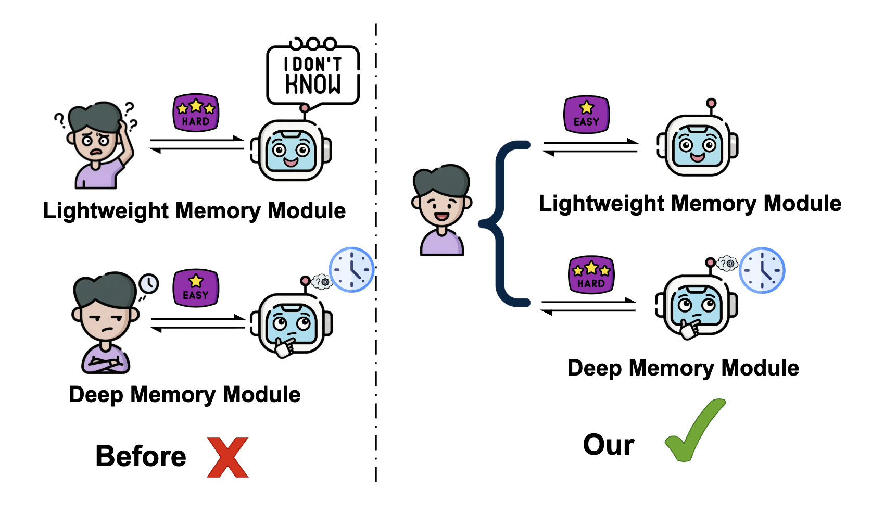
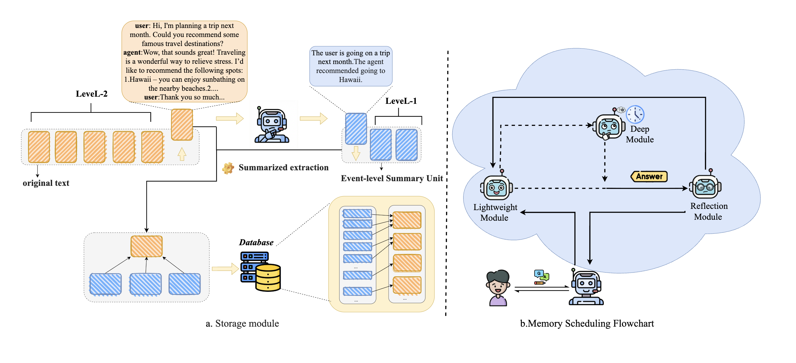

<div align="center">


# HyMem: Hybrid Memory Architecture with Dynamic Retrieval Scheduling
<p align="center">
  📄 <a href="https://arxiv.org/pdf/2602.13933">Paper</a>
</p>

</div>


## 📌 Introduction

HyMem is a hybrid memory architecture for long-context LLM agents, enabling efficient context construction and on-demand deep reasoning through dual-granularity storage and dynamic retrieval scheduling, achieving strong performance with significantly reduced computational cost.

## 🚀 Why HyMem?

###  Lower token consumption:
#### 🔹 Extract event-level summaries during storage. 
#### 🔹 Adopt dual-layer storage with two memory granularities for context construction in different scenarios.
  
### More flexible and reliable reasoning
#### 🔹 For simple questions, construct summary-level context through lightweight modules.
#### 🔹 For complex questions, dynamically activate deep modules to build raw-text-level context.
<div align="center">

</div>


---

## 🏗️ Architecture

<div align="center">

</div>

## 📂 Repository Layout

```bash
hymem/
├── config/           # Configuration management
│   └── settings.py   # Settings, LLMConfig, EmbeddingConfig
├── core/             # Core components
│   ├── memory.py            # MemoryNote, MemorySummary
│   ├── retriever.py         # SimpleEmbeddingRetriever
│   ├── llm_controller.py    # LLMController
│   └── memory_system.py     # AgenticMemorySystem
├── prompts/          # Prompt template management
│   └── templates.py         # PromptTemplates
├── data/             # Data loading
│   └── loader.py            # LoComo dataset loader
├── utils/            # Utility functions
│   └── helpers.py           # Utilities for JSON parsing, etc.
├── agent.py          # HybridMemAgent high-level interface
└── main.py           # Main entry example

scripts/
└── evaluate_locomo.py  # LoComo evaluation script
```

## 📊 Running Evaluations
```bash
# Environment Setup
conda create -n hymem python=3.10
conda activate hymem
pip install -r requirements.txt

# Run Evaluation
cd hymem/scripts
python evaluate_locomo.py --model_name gpt-4.1-mini --embed_model text-embedding-3-small --api_key your key --embed_api_key your embed key --base_url your url --embed_base_url your embed url
```

## 📚 Citation
If you use this code in your research, please cite our work:
```bibtex
@article{zhao2026hymem,
  title={HyMem: Hybrid Memory Architecture with Dynamic Retrieval Scheduling},
  author={Zhao, Xiaochen and Wang, Kaikai and Zhang, Xiaowen and Yao, Chen and Wang, Aili},
  journal={arXiv preprint arXiv:2602.13933},
  year={2026}
}
 ```
