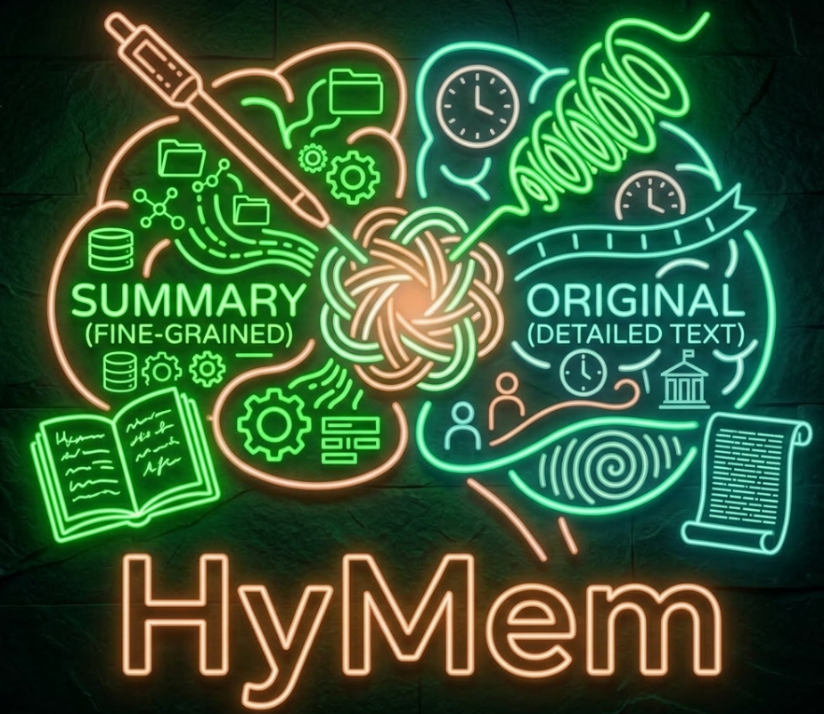
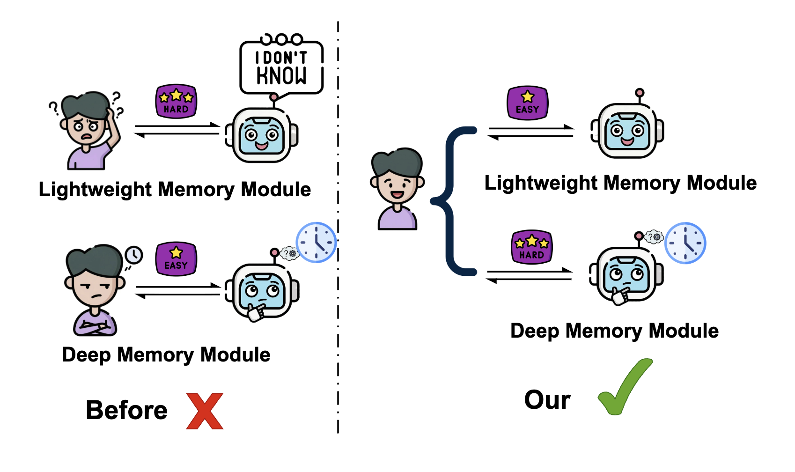
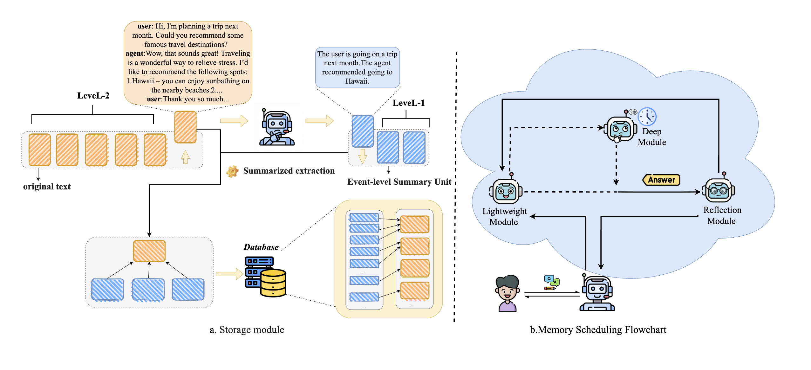

<div align="center">



# HyMem: Hybrid Memory Architecture with Dynamic Retrieval Scheduling
<p align="center">
  📄 <a href="https://arxiv.org/pdf/2602.13933">Paper</a>
</p>

</div>


## 📌 Introduction

HyMem is a hybrid memory architecture for long-context LLM agents, enabling efficient context construction and on-demand deep reasoning through dual-granularity storage and dynamic retrieval scheduling, achieving strong performance with significantly reduced computational cost.

This repository ships a **ready-to-use conversational agent** built on top of HyMem: clone the repo, plug in your own OpenAI-compatible API key, and start chatting — the agent will remember the user across turns and across sessions just like a human counterpart, while keeping per-turn cost low.

## 🚀 Why HyMem?

###  Lower token consumption:
#### 🔹 Extract event-level summaries during storage. 
#### 🔹 Adopt dual-layer storage with two memory granularities for context construction in different scenarios.

### More flexible and reliable reasoning
#### 🔹 For simple questions, construct summary-level context through lightweight modules.
#### 🔹 For complex questions, dynamically activate deep modules to build raw-text-level context.
<div align="center">

</div>

---

## 🏗️ Architecture

<div align="center">

</div>

In this codebase, HyMem is realised as four cooperating components:

- **Two-tier storage** — every chunk of conversation is kept twice: as one or
  more atomic *summary* sentences (cheap to vector-index) and as the original
  full text (lossless detailed memory). Summary entries point back to the
  detailed chunk(s) they came from, supporting many-to-many links after
  consolidation.
- **Token-budgeted short-term queue** — recent dialogue turns live in a FIFO
  queue (default 4096 tokens). The most recent few turns are always injected
  as short-term context so multi-turn references stay coherent without any
  retrieval cost.
- **Dynamic retrieval scheduling** — the *light* path searches only the
  summary index and lets the LLM decide whether the summaries suffice; the
  *deep* path is activated only when they don't, widening the recall,
  re-ranking with the LLM, and answering from the full original text.
- **Online consolidation** — newly extracted atomic facts are checked for
  near-duplicates in the index and merged in a single batched LLM call, so
  the summary index stays compact even after long-running use.

## 📂 Repository Layout

```
HyMem/
├── hymem/
│   ├── agent.py                 # HyMemAgent: high-level chat API
│   ├── cli.py                   # interactive command-line chat
│   ├── core/
│   │   ├── memory.py            # MemoryNote, MemorySummary, ConversationSession
│   │   ├── memory_system.py     # HybridMemorySystem (dynamic scheduler)
│   │   ├── retriever.py         # vector store + cosine search
│   │   └── llm_controller.py    # OpenAI-compatible LLM client (with retries)
│   ├── prompts/templates.py     # all prompt templates
│   ├── config/settings.py       # config dataclasses + loader
│   └── utils/helpers.py         # JSON parsing, token counting, …
├── figs/                        # paper figures used in this README
├── config_template.json         # copy & fill in your API keys
├── run.py                       # python run.py  ==  python -m hymem.cli
├── requirements.txt
└── setup.py
```

---

## ⚙️ Environment Setup

```bash
git clone https://github.com/xiaochenzhao-svg/HyMem.git
cd HyMem
conda create -n hymem python=3.10 -y
conda activate hymem
pip install -r requirements.txt
```

Tested on Python 3.9 +.

---

## 🔑 Configuration

Copy the template and fill in **your own** model endpoint + API key:

```bash
cp config_template.json config.json
```

Minimal `config.json`:

```json
{
  "llm": {
    "model_name": "gpt-4o-mini",
    "api_key": "sk-...",
    "base_url": "https://api.openai.com/v1",
    "temperature": 0.7
  },
  "embedding": {
    "model_name": "text-embedding-3-small",
    "api_key": "sk-...",
    "base_url": "https://api.openai.com/v1"
  },
  "retrieval": {
    "retrieve_k": 10,
    "retrieve_k_rough": 30,
    "short_term_turns": 8,
    "enable_self_check": false
  },
  "session": {
    "max_session_tokens": 4096,
    "auto_save_sessions": true,
    "async_indexing": true
  },
  "dedup": {
    "enabled": true,
    "top_k": 5,
    "sim_threshold": 0.82
  }
}
```

Any **OpenAI-compatible** endpoint works (DeepSeek, Qwen-OpenAI-mode, vLLM,
LiteLLM, Azure-with-proxy, etc.) — just point `base_url` at it.

You can also rely purely on environment variables instead of a config file:

```bash
export OPENAI_API_KEY=sk-...
export OPENAI_BASE_URL=https://api.openai.com/v1
export LLM_MODEL_NAME=gpt-4o-mini
export EMBEDDING_MODEL_NAME=text-embedding-3-small
```

---

## 💬 Run the Chat

```bash
python run.py                        # uses ./config.json
python run.py --config my.json       # use a custom config file
python run.py --persist mem_dir      # load/save long-term memories across runs
```

Inside the chat, the following slash commands are available:

| Command | What it does |
|---|---|
| `/new` | Archive the current session as a long-term detailed memory and start a fresh one |
| `/clear` | Wipe **all** memories (summary + detailed + sessions) |
| `/status` | Print memory statistics |
| `/save <dir>` | Persist all memories to `<dir>` |
| `/load <dir>` | Load memories from `<dir>` |
| `/quit` / `/exit` / `/bye` | End and (if `--persist` is set) save before exiting |

**A note on persistence.** Without `--persist`, all memories live only in
RAM and are gone when you quit; with `--persist <dir>` they are loaded on
startup and saved on shutdown so the agent really does keep a long-term brain
across runs.

---

## 🧪 Per-turn Lifecycle

```
            ┌────────────── User turn ──────────────┐
            ▼                                       │
   push into short-term FIFO queue (no LLM call)    │
            │                                       │
            ▼                                       │
  ┌─── light path ────────────────────────┐         │
  │ vector search top-k on summary index  │         │
  │      ↓                                │         │
  │ LLM(ANSWER_LIGHT): finished = ?       │         │
  │   1 → answer directly                 │         │
  │   0 → answer from summaries           │         │
  │   2 → escalate ↓                      │         │
  └───────────────────────────────────────┘         │
            │ (only if 2)                           │
            ▼                                       │
  ┌─── deep path ─────────────────────────┐         │
  │ vector search top-k_rough             │         │
  │      ↓                                │         │
  │ LLM(RETRIEVER): pick relevant ids     │         │
  │      ↓                                │         │
  │ open FULL original memory of those ids│         │
  │      ↓                                │         │
  │ LLM(ANSWER_DEEP): final reply         │         │
  └───────────────────────────────────────┘         │
            │                                       │
            ▼                                       │
  reply ─────────────────────────────────► user ◄───┘
            │
            ▼
   push reply into short-term queue; if the queue
   crosses max_session_tokens, a chunk is cut on a
   turn boundary and submitted to the BACKGROUND
   archive worker, which extracts atomic facts and
   runs dedup-merge against the existing index.
```

So a normal turn costs **1 LLM call** (light path) or **2** (deep path).
Atomic-fact extraction (`EX_SUMMARY`) and dedup are amortised — paid only
once per ~`max_session_tokens` of dialogue, off the critical path.

---

## 📚 Citation
If you use this code in your research, please cite our work:
```bibtex
@article{zhao2026hymem,
  title={HyMem: Hybrid Memory Architecture with Dynamic Retrieval Scheduling},
  author={Zhao, Xiaochen and Wang, Kaikai and Zhang, Xiaowen and Yao, Chen and Wang, Aili},
  journal={arXiv preprint arXiv:2602.13933},
  year={2026}
}
```

## License

MIT.